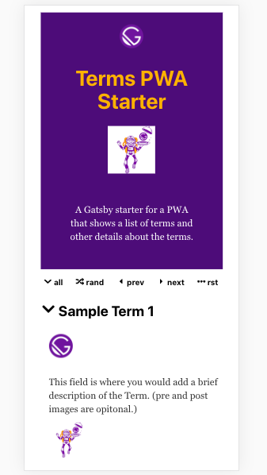
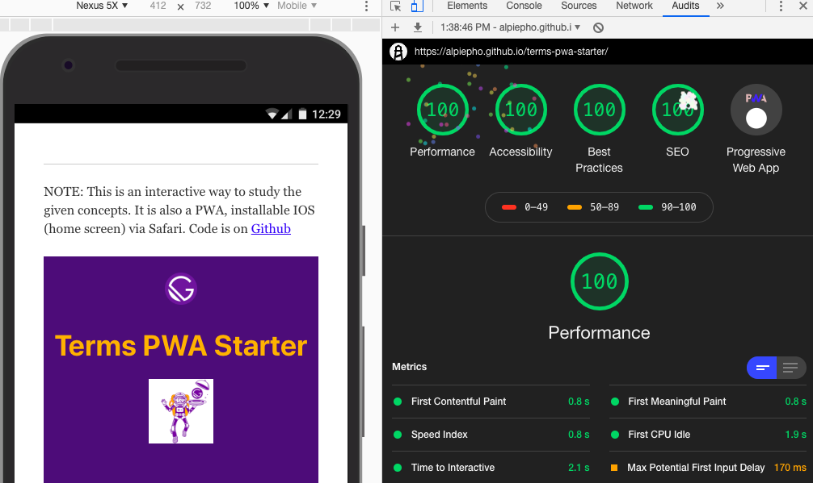

## Terms PWA Starter

Deployed on [GH-Pages](https://alpiepho.github.io/terms-pwa-starter)

This is a Gatsby starter project that implements a generic applications that
shows a list of terms with expandable panels that reveal optional summary, image, and an exandable sub-panels that can show a number of paragraphs.

The app lets the user manually view all the terms, or randomly see termrs.  The original idea was used to prepare for an interview buy listing all of that companies leadership priciples.

### After Clone

After you run 'gatsby new <new name> <url to terms-pwa-starter> you probably need to
change a few settings:

- Update this README.md with your own application description
- Update name, description and author in package.json.
- Update repository and bugs in package.json.  Asuming you deploy to GH-Pages
- Udate ./data/siteConfig.js
    - siteTitle
    - siteDescription
    - googleAnalyticsId
    - authorName
    - pathPrefix

The string for the repository and bugs field will likely be a github page in the
form https://github.com/<yourid>/<git name>.

To get your own googleAnalyticsId, go to https://analytics.google.com/analytics.  Please read and learn how to create a UA-nnnnnnnnn-n for your site.

The path prefix is the <git name> part of your GitHub url.  This is used to change
paths to images etc.  Without it, it will assume /.

Next, you will need to create a base icon image.  This should be at least 512x512.
The gatsy-image plugin will use this to generate other image sizes. Copy to src/images/site-icon.png.

If you want a favicon.ico, you may need another images. (Favicon is the little images that shows in the tab on a Chrome browser).  This icon should be a .png file of size 32x32.  Rename to favicon.ico and copy to static/images.  

Change link to where application is deployed (first link of this page.)

(Optional)  Once you get your application running, it is nice to include a screenshot here in the README.md file.  Save this as screenshot-site.png

## Success!!!

I have been exeprimenting with LightHouse testing for a few weeks.  I noticed the Look/Feel of this tool changed with a recent update of Chrome.  I also saw a cool easter egg when I hit all 100s for this app (sorry, can't show the animated fireworks):

##  Whats left TODO

This is a list of some things to finish up:

See [Issues](https://github.com/alpiepho/terms-pwa-starter/issues).

