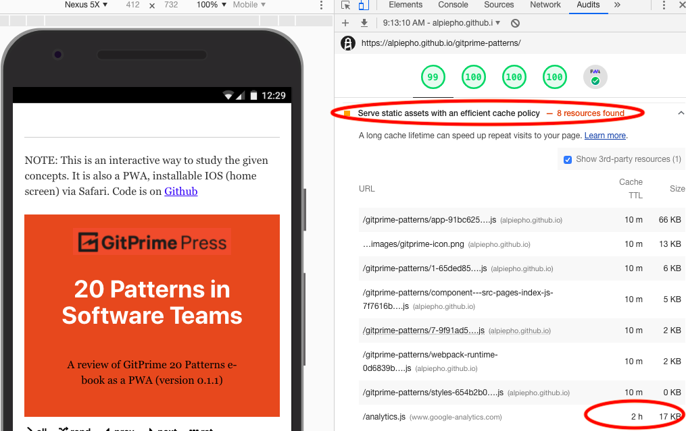

## GitPrime Patterns

Deployed on [GH-Pages](https://alpiepho.github.io/gitprime-patterns)

This is a reproduction/summary of the GitPrime ["20 Patterns"](https://blog.gitprime.com/new-book-20-patterns/) book as a Progressive Web Application (PWA).

This was developed with React.js and Gatsby.  It was bootstraped from a Gatsby starter I built, and can be found on [GitHub](https://github.com/alpiepho/terms-pwa-starter.git.)

## Success.

I have been exeprimenting with LightHouse testing for a few weeks.  Here is a screenshot for this application:

Looks like there is a cache time issue with Google Analytics (not sure we can do anything about it...no fireworks today :( )):

## Known Issues

- Subterm open/close doesn't work properly with all
- Be cautious changing data.  it is diffucult debuging GraphQL issues.

Also see [Issues](https://github.com/alpiepho/terms-pwa-starter/issues) from the Gatsby Starter project.

## Future Ideas

- Reduce About vertical size.
- Review how much text is shown.
- Add link to actual document for more details from 'How to recognize it' sections
